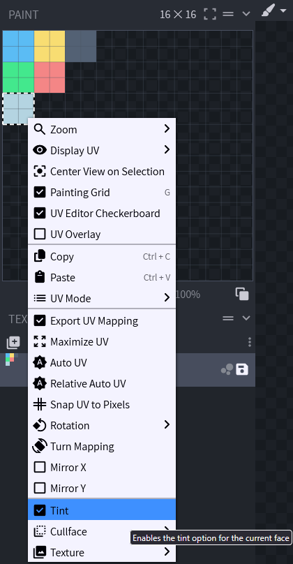

# ⚒️ Items

### Components

As of Minecraft 1.20.6, items now use what is called Components, or DataComponents, to specify specific features. This covers anything from consumable items, tool-properties and death protection.

You can see a complete list here: [#components](items-advanced.md#components "mention")

### ItemTemplate

This allows you to easily copy properties from a template-item onto other items.\
In the item you want to copy properties to, simply specify the ItemID\
It also supports a list of multiple items to merge several into one

```yml
template_item:
  itemname: Template Item
  material: DIAMOND

template_item1:
  template: template_item
  itemname: Template Item 1

template_item2:
  templates: 
    - template_item
    - template_item1
```

You can also use **Template Placeholder** to simplify configs even further\
&#xNAN;**\<item\_id> -** Can be used to insert the ID of the item into the relevant part\
&#xNAN;**\<item\_id\_capitalized> -** Insert the ID in a formatted format; `item_id` -> `Item Id`\
&#xNAN;**\<lore> -** Insert the lore of the item at a point in the lore of the template

```yaml
item:
  template: template_item
another_item:
  template: template_item
  lore:
    - "some lore"
template_item:
  itemname: <item_id_capitalized>
  Components:
    item_model: nexo:<item_id>
  lore:
    - "template lore 1"
    - "<lore>"
    - "template lore 2"
```

### PersistentData

This lets you add custom data into the items PersistentDataContainer. These exist within the `PublicBukkitValues` of the item. Type is the type of data to add. Supported types can be found [here](https://jd.papermc.io/paper/1.21.5/org/bukkit/persistence/PersistentDataType.html#field-summary). Nexo also has some custom DataTypes which can be used, like UUID. These can be found [here](https://hub.jeff-media.com/javadocs/morepersistentdatatypes/)

```yaml
myitem:
  PersistentData:
    - type: STRING
      key: mynamespace:something
      value: "Hi this is a string"
```

### Itemname

This allows you to change the name displayed of your item without interfering with renamed items.

```yaml
my_item:
  itemname: "<red><bold>Example"
```

### Material

This allows you to change the item type. Defaults to PAPER if unspecified.

```yaml
my_item:
  material: WOODEN_SWORD
```

### Color

This allows you to change the color of an item made of a supported material (e.g. leather armor).


{% column width="58.333333333333336%" %}
```yaml
my_item:
  color: 3, 252, 136 #rgb
```

To change the color of your model, you need to set Tint property.\
How to set `Tint` property using BlockBench:

* Open the model in BlockBench
* Open Paint Tab
* Select face you want to change color
* Right click on the face and check `Tint` box


{% column width="41.666666666666664%" %}




### Lore

This allows you to add lines of text under the item name.

```yaml
my_item:
  lore:
  - "One line"
  - "<green>Another line"
```

### Disable Enchanting

This options allows you to prevent an item from being enchanted via anvils or enchantment tables.\
This does not prevent enchantments from being applied in the config.\\

```yaml
my_item:
  disable_enchanting: true
```


As of 1.21.2+ you should use Enchantable-Component (`Components.enchantable: 0`)


### excludeFromInventory

This option allows you to exclude an item from the nexo inventory. It will no longer be displayed but you can still get it using [nexo give command](../general-usage/commands.md#get-the-items). It is useful for items used in other plugins like inventory icons.

```yaml
my_item:  
  excludeFromInventory: true
```

### unbreakable

```yaml
my_item:
  unbreakable: true
```

### ItemFlags


As of 1.21.5+ this should be switched with `Components.tooltip_display` [#components](items-advanced.md#components "mention")


This allows you to set ItemFlags to an item, get the list of available flags [here](https://hub.spigotmc.org/javadocs/bukkit/org/bukkit/inventory/ItemFlag.html).

```yaml
my_item:
  ItemFlags:
    - HIDE_ENCHANTS
    - HIDE_ATTRIBUTES
    - HIDE_UNBREAKABLE
    - HIDE_DESTROYS
    - HIDE_PLACED_ON
    - HIDE_POTION_EFFECTS
```

### PotionEffects


This should be swapped with Consumable Component [components.md](items-advanced/components.md "mention") for 1.21.4+


This allows you to add custom Potion Effects to your potion. Get the list of available effects [here](https://jd.papermc.io/paper/1.21.3/org/bukkit/potion/PotionEffectType.html).

```yaml
my_item:
  PotionEffects:
    # - type: Get the list here: https://jd.papermc.io/paper/1.21.3/org/bukkit/potion/PotionEffectType.html
    # - duration: duration of effect (2s, 3t, 4m)
    # - amplifier: potion effects level
    # - ambient: true/false, makes potion effect produce more, translucent, particles.
    # - particles: true/false, whether this effect has particles or not
    # - icon: true/false, whether this effect has an icon or not
    - type: WITHER
      duration: 10s
      amplifier: 2
      ambient: false
      particles: true
      icon: true
```

### AttributeModifiers

This allows you to add minecraft attributes to your item. They are very powerful and allow you to make an item that adds hearts, increases the player's speed, etc. Get the list of available attributes [here](https://hub.spigotmc.org/javadocs/spigot/org/bukkit/attribute/Attribute.html).

```yaml
my_item:
  AttributeModifiers:
    # - attribute: Get the list here: https://hub.spigotmc.org/javadocs/spigot/org/bukkit/attribute/Attribute.html
    # - operations: 0 for ADD_NUMBER, 1 for ADD_SCALAR, 2 for MULTIPLY_SCALAR_1;
    # - slot: HAND, OFFHAND, MAINHAND, FEET, LEGS, CHEST, HEAD, SADDLE, ANY, ARMOR
    - attribute: MOVEMENT_SPEED
      amount: 0.1 
      operation: 0
      slot: HAND
      #uuid: 00000000-0000-0000-0000-000000000000 
```

### Enchantments

If you want to enchant your item (even with non vanilla levels like for example sharpness 15), you can do it with this section. This should also support Enchantment Plugins that register enchantments as proper ones, using `namespace:key`

```yaml
my_item:
  Enchantments:
    protection: 4
    flame: 34
    sharpness: 18
```

### How do I set a specific CustomModelData?

```yaml
my_item:
  Pack:
    parent_model: "custom/items/generated_elite"
    texture: custom/items/elite_zombie_walk
    custom_model_data: 452
```

## Pack options

This part has a dedicated page, you can consult it [here](items-advanced/item-appearance.md).

## Mechanics options

Mechanics are custom features in Nexo. You can find more under [Broken link](broken-reference "mention") section
