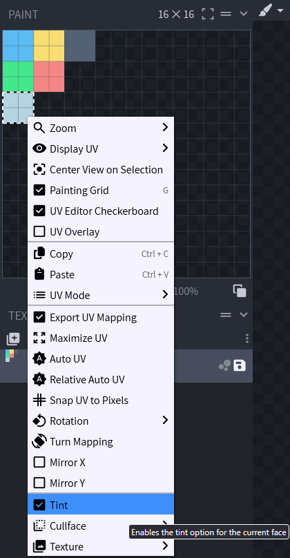

# ⚒️ Items

### Components

As of Minecraft 1.20.6, items now use what is called Components, or DataComponents, to specify specific features. This covers anything from consumable items, tool-properties and death protection.

You can see a complete list here: [components.md](components.md "mention")

### ItemTemplate

This allows you to easily copy properties from a template-item onto other items.\
In the item you want to copy properties to, simply specify the ItemID\
It also supports a list of multiple items to merge several into one

```yml
template_item:
  itemname: Template Item
  material: DIAMOND

template_item1:
  template: template_item
  itemname: Template Item 1

template_item2:
  templates: 
    - template_item
    - template_item1
```

You can also use **Template Placeholder** to simplify configs even further\
\&#xNAN;**\<item\_id> -** Can be used to insert the ID of the item into the relevant part\
\&#xNAN;**\<item\_id\_capitalized> -** Insert the ID in a formatted format; `item_id` -> `Item Id`\
\&#xNAN;**\<lore> -** Insert the lore of the item at a point in the lore of the template

```yaml
item:
  template: template_item
another_item:
  template: template_item
  lore:
    - "some lore"
template_item:
  itemname: <item_id_capitalized>
  Components:
    item_model: nexo:<item_id>
  lore:
    - "template lore 1"
    - "<lore>"
    - "template lore 2"
```

### ItemModel Builder

This lets you generate an ItemModel for your NexoItem without needing to provide the ResourcePack file. You can directly reference all you need right in the config. More detailed info can be found at [https://github.com/Nexo-MC/Nexo-Documentation/blob/master/configuration/items/items/README.md#itemmodel-builder](https://github.com/Nexo-MC/Nexo-Documentation/blob/master/configuration/items/items/README.md#itemmodel-builder "mention")

### PersistentData

This lets you add custom data into the items PersistentDataContainer. These exist within the `PublicBukkitValues` of the item.\
Type is the type of data to add. Supported types can be found [here](https://jd.papermc.io/paper/26.1.2/org/bukkit/persistence/PersistentDataType.html#field-detail).\
Nexo also has some custom DataTypes which can be used, like UUID. These can be found [here](https://github.com/mfnalex/MorePersistentDataTypes#list-of-all-data-types)

```yaml
myitem:
  PersistentData:
    - type: STRING
      key: mynamespace:something
      value: "Hi this is a string"
```

There is also a CustomData [components.md](components.md "mention") if setting things outside of the normal PublicBukkitValues-entry for the item is wanted

### Item Name

This allows you to change the name displayed of your item without interfering with renamed items.

```yaml
my_item:
  itemname: "<red><bold>Example"
```

### Material

This allows you to change the item type. Defaults to PAPER if unspecified.

```yaml
my_item:
  material: WOODEN_SWORD
```

### AttributeModifiers

This allows you to add minecraft attributes to your item. They are very powerful and allow you to make an item that adds hearts, increases the player's speed, etc.

```yaml
my_item:
  AttributeModifiers:
    - attribute: MOVEMENT_SPEED
      amount: 0.1
      operation: ADD_NUMBER
      slot: MAINHAND
      display: # 1.21.6+ only
        type: override
        text: "Value: <red>0.1"
```

List of Attributes can be found [here](https://jd.papermc.io/paper/1.21.11/org/bukkit/attribute/Attribute.html)\
List of Operations can be found [here](https://jd.papermc.io/paper/1.21.11/org/bukkit/attribute/AttributeModifier.Operation.html)\
List of Slots can be found [here](https://jd.papermc.io/paper/1.21.11/org/bukkit/inventory/EquipmentSlotGroup.html)

The types of AttributeDisplay are; **default, hidden & override**\
Of these only **override** has an additional field, text, which is the new text to show

### Color

This allows you to change the color of an item made of a supported material (e.g. leather armor).


Minecraft 26.3 removed the `map_color`-component, so filled maps can no longer be colored on that version and above




```yaml
my_item:
  color: 3, 252, 136 #rgb
```

To change the color of your model, you need to set Tint property.\
How to set `Tint` property using BlockBench:

* Open the model in BlockBench
* Open Paint Tab
* Select face you want to change color
* Right click on the face and check `Tint` box







### Lore

This allows you to add lines of text under the item name.

```yaml
my_item:
  lore:
  - "One line"
  - "<green>Another line"
```

### Disable Enchanting

To prevent an item from being enchanted, use the Enchantable-Component with a value of 0.\
This does not prevent enchantments from being applied in the config.

```yaml
my_item:
  Components:
    enchantable: 0
```

Vanilla only blocks the enchanting table this way.\
With `Misc.extended_enchantable` enabled in `settings.yml` (the default), Nexo also blocks enchanting the item in anvils and disenchanting it in grindstones.


`disable_enchanting` was removed in Nexo 1.29.\
Items still using it are converted to `Components.enchantable: 0` automatically


### excludeFromInventory

This option allows you to exclude an item from the nexo inventory. It will no longer be displayed but you can still get it using [nexo give command](../../general-usage/commands.md#get-the-items). It is useful for items used in other plugins like inventory icons.

```yaml
my_item:  
  excludeFromInventory: true
```

### unbreakable

```yaml
my_item:
  unbreakable: true
```

Leaving it out keeps whatever the item already has, so items made unbreakable by another plugin stay unbreakable when Nexo updates them.\
Set it to `false` to always remove it.

### ItemFlags


As of 1.21.5+ this should be switched with `Components.tooltip_display` [https://github.com/Nexo-MC/Nexo-Documentation/blob/master/configuration/items/items/README.md#components](https://github.com/Nexo-MC/Nexo-Documentation/blob/master/configuration/items/items/README.md#components "mention")


This allows you to set ItemFlags to an item, get the list of available flags [here](https://hub.spigotmc.org/javadocs/bukkit/org/bukkit/inventory/ItemFlag.html).

```yaml
my_item:
  ItemFlags:
    - HIDE_ENCHANTS
    - HIDE_ATTRIBUTES
    - HIDE_UNBREAKABLE
    - HIDE_DESTROYS
    - HIDE_PLACED_ON
    - HIDE_POTION_EFFECTS
```

### Enchantments

If you want to enchant your item (even with non vanilla levels like for example sharpness 15), you can do it with this section. This should also support Enchantment Plugins that register enchantments as proper ones, using `namespace:key`

```yaml
my_item:
  Enchantments:
    protection: 4
    flame: 34
    sharpness: 18
```

### How do I set a specific CustomModelData?

```yaml
my_item:
  Pack:
    parent_model: "custom/items/generated_elite"
    texture: custom/items/elite_zombie_walk
    custom_model_data: 452
```

## Pack options

This part has a dedicated page, you can consult it [here](item-appearance.md).

## Mechanics options

Mechanics are custom features in Nexo. You can find more under [https://github.com/Nexo-MC/Nexo-Documentation/blob/master/configuration/items/broken-reference/README.md](https://github.com/Nexo-MC/Nexo-Documentation/blob/master/configuration/items/broken-reference/README.md "mention") section
