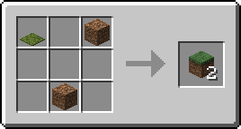
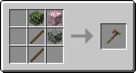
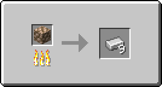
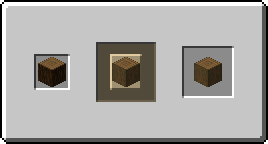

# 🧑‍🍳 Recipes

Recipes can be created directly in the relevant file within the `Nexo/recipes` directory, or through the ingame RecipeBuilder.\
The RecipeBuilder can be accessed with the command `/nexo recipes builder`.\
Drag your desired items into the crafting slots to create your recipe. Make sure to set the "output" slot to the item you want to give.

### Available Recipe Types:

* SHAPELESS - Allows each ingredient to be put in any slot
* SHAPED - Requires ingredients to be in a specific shape
* FURNACE - Recipe for Furnaces
* BLASTING - Recipe for Blast Furnace
* SMOKING - Recipe for Smoker
* STONECUTTING - Recipe for StoneCutter
* SMITHING - Recipe for Smithing Table - This is added via [NexoAddon](https://nexoaddon.gitbook.io/docs/recipes/smithing-recipe)

## Examples:

### Shapeless

`amount` in result specifies how many of said item you should get

`amount` in ingrediets specifies how many slots that item will need

```yaml
grass_block_shapeless:
  result:
    minecraft_type: GRASS_BLOCK
    amount: 2
  ingredients:
    A:
      amount: 1
      minecraft_type: MOSS_CARPET
    B:
      amount: 2
      minecraft_type: DIRT
```

<div align="left"><figure><figcaption></figcaption></figure></div>

### Shaped

You can also use Minecraft tags and Nexo items in recipes

```yaml
forest_axe:
  result:
    nexo_item: forest_axe
  ingredients:
    A:
      tag: minecraft:leaves
    B:
      minecraft_type: STICK
  shape:
  - _AA
  - _BA
  - _B_

```

<div align="left"><figure><figcaption></figcaption></figure></div>

### Furnace + Blasting + Smoking

```yaml
raw_iron_block_to_iron:
  result:
    minecraft_type: IRON_INGOT
    amount: 9
  input:
    minecraft_type: RAW_IRON_BLOCK
  cookingTime: 100
  experience: 20
```

<div align="left"><figure><figcaption></figcaption></figure></div>

### Stonecutting

```yaml
stripped_spruce_log:
  result:
    minecraft_type: STRIPPED_SPRUCE_LOG
  input:
    minecraft_type: SPRUCE_LOG
```

<div align="left"><figure><figcaption></figcaption></figure></div>