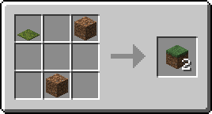
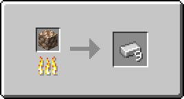
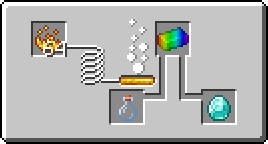

# 🧑‍🍳 Recipes

Recipes can be created directly in the relevant file within the `Nexo/recipes` directory.\
It can also be made in RecipeBuilders with the command `/nexo recipes builder`.\
Drag your desired items into the crafting slots to create your recipe. Make sure to set the "output" slot to the item you want to give.

Each Recipe-type has its own folder in `plugins/Nexo/recipes`, meaning you can organize recipes inside each folder into different files, sub-folders, etc.\
The RecipeBuilder will store recipes inside `plugins/Nexo/recipes/X/X_recipes.yml`, X being the type (shaped, shapeless, etc.)


Some Recipe-Types cannot be made through in-game builders, specifically [predicate-recipes.md](predicate-recipes.md "mention")


In addition to the specific Recipe-Station types below, there are more special RecipeTypes.

[predicate-recipes.md](predicate-recipes.md "mention") allow you to have more advanced conditions and predicates for a recipe

## Crafting-Table, Crafter & Player-Inventory

#### Shaped Recipes

This is recipes which have a specific shape, and can be filled into PlayerInventory-Grid,\
Crafting Table or Crafters in any orientation and order\
`amount` in result specifies how many of said item you should get.\
Using `amount` for an Ingredient will require that many to exist in the grid for each slot.

```yaml
amount_recipe_example:
  result:
    nexo_item: forest_axe
  shape:
  - 'SSS'
  - ' W '
  - ' W '
  ingredients:
    S:
      minecraft_type: DIAMOND
      amount: 2
    W:
      minecraft_type: WATER_BUCKET
```

<div align="left"><figure><figcaption></figcaption></figure></div>

#### Shapeless Recipes

This is recipes which have no specific shape, and can be filled into PlayerInventory-Grid,\
Crafting Table or Crafters in any orientation and order

`amount` in result specifies how many of said item you should get.\
Using `amount` for an Ingredient will require that many to exist in the grid in one or more slots.

```yaml
grass_block_shapeless:
  result:
    minecraft_type: GRASS_BLOCK
    amount: 2
  ingredients:
    A:
      minecraft_type: MOSS_CARPET
    B:
      minecraft_type: DIRT
    C:
      minecraft_type: DIRT
```

<div align="left"><figure><figcaption></figcaption></figure></div>

#### Crafter Recipes

These are recipes which will only work in the Crafter block.\
_&#x54;hese will not work in PlayerInventory or Crafting Tables_

<div align="left"><figure><figcaption></figcaption></figure></div>

```yaml
crafter_only_axe:
  result:
    nexo_item: forest_axe
  shape:
  - 'DDD'
  - ' S '
  - ' S '
  ingredients:
    D:
      minecraft_type: DIAMOND
    S:
      minecraft_type: BLAZE_ROD
```

***

## Furnace, Blasting, Smoker & Campfire

#### Furnace, Blasting & Smoking Recipes

Furnace, Blasting & Smoking recipes function the same, but allow you to split them us in order to have various requirements for each station.

```yaml
raw_iron_block_to_iron:
  result:
    minecraft_type: IRON_INGOT
    amount: 9
  input:
    minecraft_type: RAW_IRON_BLOCK
  cookingTime: 100
  experience: 20
```

<div align="left"><figure><figcaption></figcaption></figure></div>

#### Campfire Recipes

Campfire recipes are again largely the same as the stations above, but can cook several different recipes at the same time.

<div align="left"><figure><figcaption></figcaption></figure> <figure><figcaption></figcaption></figure></div>

```yaml
forest_axe_from_campfire:
  input:
    minecraft_type: NETHERITE_AXE
  result:
    nexo_item: forest_axe
  cookingTime: 100
  experience: 2
```

***

## Stonecutter Recipes

```yaml
stripped_spruce_log:
  result:
    minecraft_type: STRIPPED_SPRUCE_LOG
  input:
    minecraft_type: SPRUCE_LOG
```

***

## Brewing Stand Recipes

```yaml
diamond:
  result:
    minecraft_type: DIAMOND
  input:
    minecraft_type: GLASS_BOTTLE
  ingredient:
    nexo_item: rainbow_ingot
```

<div align="left"><figure><figcaption></figcaption></figure></div>

***

## Smithing Recipes

Smithing Recipes allow for several new ways to handle crafting, upgrading and customizing items.\
Nexo adds all of these with Custom-Recipes that can be used in a bunch of combinations

_These recipes do not support_ [predicate-recipes.md](predicate-recipes.md "mention")options

#### Upgrade Recipes

To make a recipe where you "upgrade" an item from A to B, it needs to copy the data.\
This preserves names, lore, enchantments and so on. \
For example for upgrading an _Iron Backpack_ -> _Diamond Backpack_

<div align="left"><figure><figcaption></figcaption></figure></div>

```yaml
forest_sword_upgrade:
  template:
    minecraft_type: NETHERITE_UPGRADE_SMITHING_TEMPLATE
  base:
    nexo_item: forest_sword
  addition:
    minecraft_type: NETHERITE_INGOT
  result:
    nexo_item: forest_axe
  copy_components: true
```

#### Custom Trim Recipes

To make a recipe which lets you put any Trim-Pattern on an item, custom via a datapack or vanilla, you can follow the example below. This can be any custom item, vanilla or anything.

<div align="left"><figure><figcaption></figcaption></figure></div>

```yaml
paper_template_trim:
  template:
    minecraft_type: PAPER
  base:
    minecraft_type: IRON_CHESTPLATE
  addition:
    minecraft_type: AMETHYST_SHARD
  trim_pattern: minecraft:silence
```

***

## Disabling Recipes <a href="#disabling-recipes" id="disabling-recipes"></a>

There is also a new file for disabling recipes in `Nexo/recipes/disabled_recipes.yml` .\
In this file, simply add the Recipe-Key, `minecraft:vanilla_recipe` , and Nexo will disable it.
