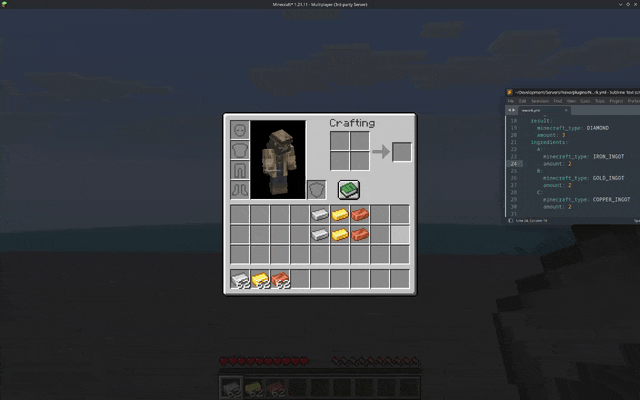
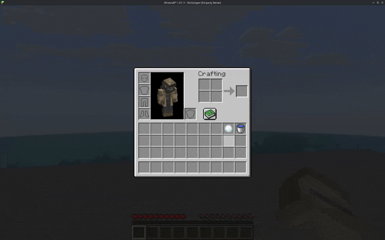
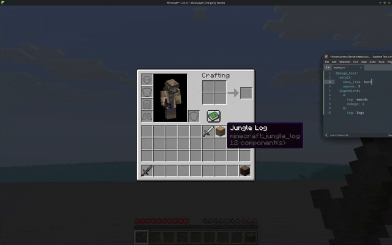

# Predicate Recipes

Predicate-Recipes are recipes which have special conditions not tied to the vanilla system explicitly\
Currently Nexo comes with three main-types of Predicate-Recipes:

#### Amount-Predicate

This allows you to define the amount of a given Ingredient the recipe requires

<div align="left"><figure><figcaption><p>Recipe showing a specific amount of an Ingredient is required to craft</p></figcaption></figure></div>

#### Replacement-Predicate

This allows you to define an item which should remain after the recipe is crafted\
For example, a recipe which takes a Bucket Of Water, and leaves behind a Empty Bucket

_This recipe cannot be made through the in-game builders, only directly in files_

<div align="left"><figure><figcaption><p>Recipe which leaves behind an empty Bucket after crafted</p></figcaption></figure></div>

#### Durability Damage-Predicate

This allows you to define if an item should take durability damage, instead of immediatley being used up when crafting. For example a knife which takes damage when crafting meat

_This recipe cannot be made through the in-game builders, only directly in files_

<div align="left"><figure><figcaption><p>Sword taking damage after "cutting up" Wood when crafting recipe</p></figcaption></figure></div>

#### Transmute Recipes

These are recipes which let you copy over data from one item onto another

<div align="left"><figure><figcaption></figcaption></figure></div>

```yaml
forest_sword_to_axe:
  input:
    nexo_item: forest_sword
  material:
    minecraft_type: LAPIS_LAZULI
  result:
    nexo_item: forest_axe
  preserve:
  - damage
  - enchantments
  - custom_name
```
