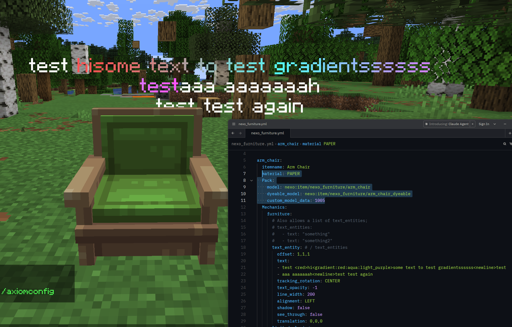

# 🔱 Custom Trident

Nexo allows you to make custom tridents and trident-projectiles.\
This feature will work best on 1.21.4+ servers but will also work on lower ones\
The Trident-mechanic is pretty straight-forward, but also has some optional properties, mainly applicable to lower versions.

By default any item using TRIDENT as it's material is a Custom Trident\
The Trident-Mechanic is not strictly necessary unless one wants to tweak the properties

### Properties

`thrown_item_model` - The ItemModel to show on the Trident-projectile. This only applies to 1.21.4+ servers. If unspecified it will default to `Components.item_model` if specified.

`thrown_item` - Refers to the NexoItem to display for the Projectile. Defaults to the item of this mechanic if unspecified

`display_transform` - Lets you set the Transform the model should use, mainly useful when not using a separate ItemModel

`rotation` - Lets you rotate the base yaw/pitch of the projectile


Showcasing Forest Trident




For 1.21.4+ servers there are two approaches you can take, one being a unified ItemModel\
Second being a separate one for the thrown and held item.\
\
The Forest Trident Nexo comes with uses a unified ItemModel to dictate when to show what model.\
This is mainly for displaying a different model when held/icon/throwing.\
Like the normal trident-item, which has a 2d Icon in GUIs, then also held in hand one way when throwing and normal.\
Below is the example Forest-Trident ItemModel Nexo comes with

```json
{
  "model": {
      "type": "minecraft:condition",
      "property": "minecraft:using_item",
      "on_false": {
        "type": "minecraft:model",
        "model": "nexo:item/nexo_tools/forest_trident"
      },
      "on_true": {
        "type": "minecraft:model",
        "model": "nexo:item/nexo_tools/forest_trident_throwing"
      }
    }
}
```

This has a different Model based on the condition if the item is being used or not.\
This then goes into `assets/nexo/items/forest_trident.json` and is referenced in the NexoItem like below\
As shown above this then links to two separate normal JSON-Models:\
`assets/nexo/models/item/nexo_tools/forest_trident.json`\
`assets/nexo/models/item/nexo_tools/forest_trident_throwing.json`&#x20;

The NexoItem-config should then look something like this:

```yaml
forest_trident:
  itemname: Forest Trident
  material: TRIDENT
  Components:
    item_model: nexo:forest_trident
  Mechanics:
    trident:
      display_transform: HEAD
```

<div><figure><figcaption><p>Forest Trident with the normal default Model</p></figcaption></figure> <figure><figcaption><p>Forest Trident in the "throwing" model, rotated</p></figcaption></figure></div>



```yaml
forest_trident:
  itemname: Forest Trident
  material: TRIDENT
  Pack:
    model: nexo:item/nexo_tools/forest_trident
  Mechanics:
    trident:
      thrown_item: forest_trident_throwing
      display_transform: HEAD

forest_trident_thrown:
  excludeFromCommands: true
  excludeFromInventory: true
  Pack:
    model: nexo:item/nexo_tools/forest_trident_throwing
```


