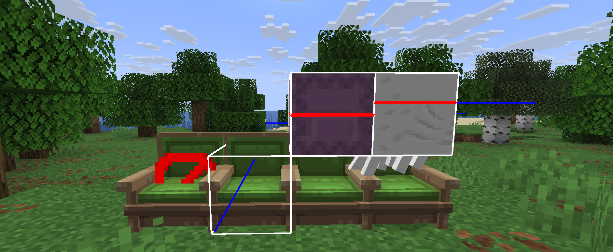

# 🎯 Hitbox

Furnitures come with two core types, with and without collision-interactions.\
Collision hitboxes are normal barrier-blocks, whilst non-solid ones are interaction-entities.\
Interaction-entities have no collision, but can be any width and height, unlike barriers which are normal 1x1x1 blocks. Below are examples of how to use both.\
\
There are also two other types of hitboxes with collision but some other extra functionalities, Shulker- & Ghast-type hitboxes. Ghast Hitboxes are only available for 1.21.6+

<figure><figcaption>
Showing off Barrier, Interaction, Shulker &#x26; Ghast Hitboxes
</figcaption></figure>
