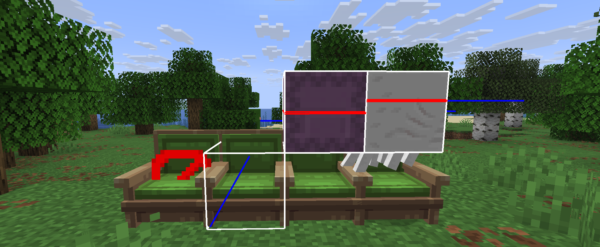

---
layout:
  width: default
  title:
    visible: true
  description:
    visible: false
  tableOfContents:
    visible: true
  outline:
    visible: true
  pagination:
    visible: true
  metadata:
    visible: true
  tags:
    visible: true
---

# 🎯 Hitbox

Furnitures come with two core types, with and without collision-interactions.\
Collision hitboxes are normal barrier-blocks, whilst non-solid ones are interaction-entities.\
Interaction-entities have no collision, but can be any width and height, unlike barriers which are normal 1x1x1 blocks. Below are examples of how to use both.\
\
There are also two other types of hitboxes with collision but some other extra functionalities, Shulker- & Ghast-type hitboxes. Ghast Hitboxes are only available for 1.21.6+


Furniture-Hitboxes might conflict with some Anti-Cheat plugins; [anti-cheat-plugins.md](../../../compatibility/anti-cheat-plugins.md "mention")


<figure><figcaption>
Showing off Barrier, Interaction, Shulker &#x26; Ghast Hitboxes
</figcaption></figure>
