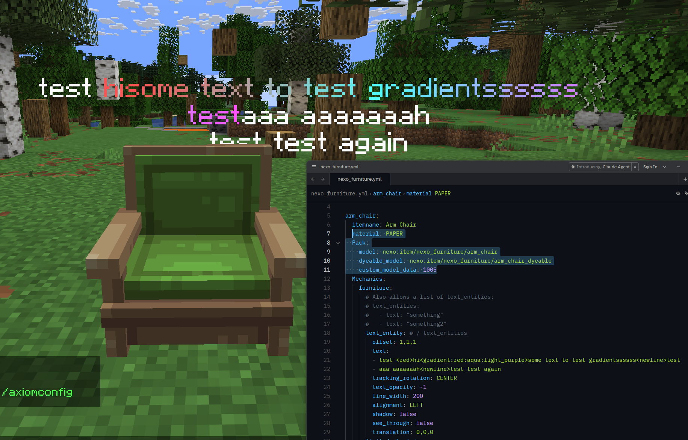

# Text-Entities

Nexo allows you to attach Text-Entities to placed furniture to display text, [glyphs](../../configuration/glyphs/ "mention") or anything else.\
You can use one, or several, all depending on what you need.\
They have a bunch of properties, most similar to [#furniture-properties](./#furniture-properties "mention"), with some unique ones like;

`text` - The text to display for this Text-Entity. Can be a single line or a list of strings\
`offset` - The offset for which this entity should exist from the base-furniture\
`line_width` - The width of a line before it is wrapped to next line\
`text_opacity` - The opacity of the text\
`background_color` - The color of the background in ARGB Format; _<mark style="color:$info;">**#AARRGGBB / a,r,g,b**</mark>_ | <mark style="color:$info;">Optional</mark>\
`see_through` - If the text is able to be seen through blocks; <mark style="color:$info;">Defaults to false</mark>

```yaml
arm_chair:
  itemname: Arm Chair
  material: PAPER
  Pack:
    model: nexo:item/nexo_furniture/arm_chair
    dyeable_model: nexo:item/nexo_furniture/arm_chair_dyeable
    custom_model_data: 1005
  Mechanics:
    furniture:
      # Also allows a list of text_entities;
      # text_entities:
      #   - text: "something"
      #   - text: "something2"
      text_entity: # / text_entities
        offset: 1,1,1
        text:
        - test <red>hi<gradient:red:aqua:light_purple>some text to test gradientssssss<newline>test
        - aaa aaaaaaah<newline>test test again
        tracking_rotation: CENTER
        text_opacity: -1
        line_width: 200
        alignment: LEFT
        shadow: false
        see_through: false
        translation: 0,0,0
```

<figure><figcaption></figcaption></figure>
